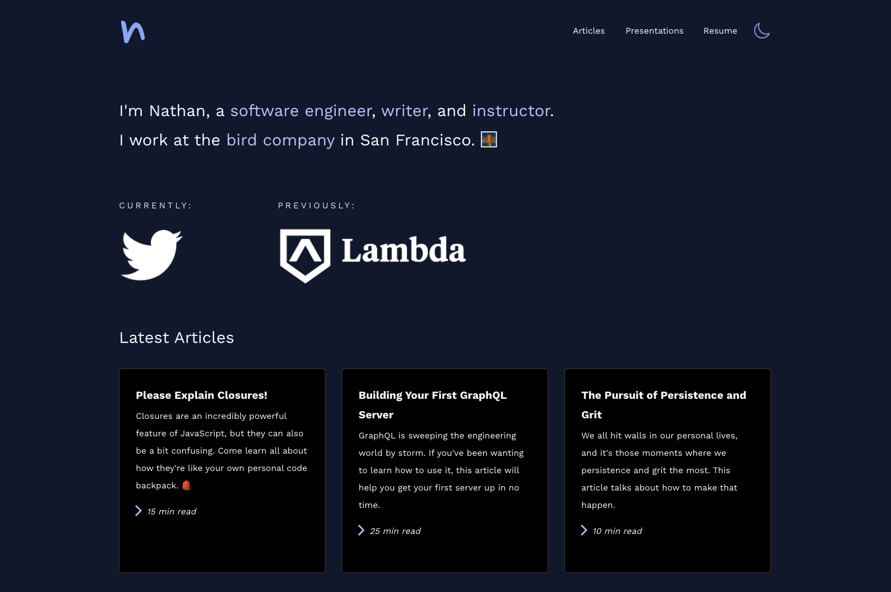

# Personal Website 🤌🏻

         

## GETTING STARTED 💭

This is the Github repository for my personal website. The entire codebase (and site) revolves around the idea of content discoverability, as I built it to allow others to more easily consume content that I create. My previous portfolio was based around projects, but it wasn't extensible or malleable enough for me.

Also, making this site gave me the opportunity to really stretch out and craft a site that felt was mine. While I've borrowed inspiration from multiple places (see [acknowledgements section](#acknwoledgements)), the final product is my own creation. It's my own corner of the Internet, a place where I can blog, create, and own my content.

It will also spawn many new personal projects (such as a potential scribing server and more).

Welcome. I hope you enjoy the site as much as I enjoyed making it.

## TABLE OF CONTENTS 📚

- [Getting Started](#getting-started)
- [Technology Stack](#technology-stack)
- [Unit Testing](#unit-testing)
- [Project Management](#project-management)
- [Acknowledgements](#acknowledgements)

## TECHNOLOGY STACK 🐋

I tried to use a fairly modern tech stack (both on front-end and back-end) while testing out some new technologies that I'd never used before. This resulted in a fast, performant, and easily extensible web app that should be fairly future proof for the coming years. I used:

- Front-end:
  - [Axios](https://www.npmjs.com/package/axios)
  - [Formik](https://formik.org/)
  - [GraphQL](https://github.com/graphql/graphql-js)
  - [Next.js](https://nextjs.org/)
  - [React Markdown](https://github.com/remarkjs/react-markdown)
  - [React Query](https://react-query.tanstack.com/)
  - [React Syntax Highlighter](https://github.com/react-syntax-highlighter/react-syntax-highlighter)
  - [Styled Components](https://styled-components.com/)
- Back-end:
  - [Docker](https://www.docker.com/)
  - [Golang](https://go.dev/)
  - `FINISH LATER`

## UNIT TESTING 🧪

- Front-end:
  - [React Testing Library](https://testing-library.com/)
  - `COMING SOON`
- Back-end:
  - `COMING SOON`

## PROJECT MANAGEMENT 🏗

This project was managed using a Trello board which can be found [here](https://trello.com/b/jrhKtCs4/personal-portfolio-v2).

## ACKNOWLEDGEMENTS 🎉

- Thanks to my parents for supporting my journey of learning to code. I couldn't have done it without you.
- Thanks [Lambda School](https://lambdaschool.com/) for teaching me the skills that allow me to build applications just like this one.
